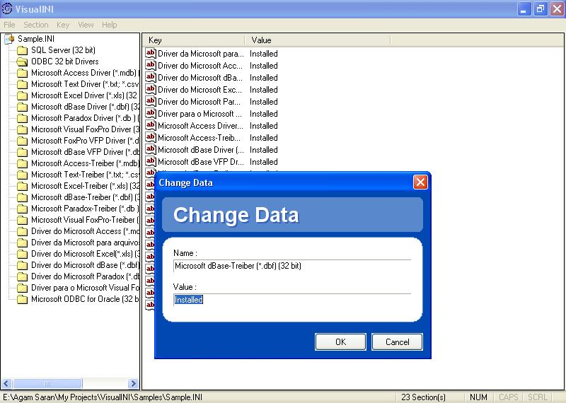



## VisualINI

### Description

Visually Create, Edit and Modify INI files. Its worth looking at the screenshot. Much like regedit but designed for the modification of Configuration files. You can Create/Modify/Delete Keys/Sections. The Modify Dialog is shown on the basis of the type of data contained in a value. For example if data containes path for some file, it adds the browse button in front of the textbox.

You can also vote, if you like it.
 
### More Info
 

             |
---                |---
**Submitted On**   |2006-07-26 20:10:48
**By**             |[Agam Saran](https://github.com/Planet-Source-Code/PSCIndex/blob/master/ByAuthor/agam-saran.md)
**Level**          |Intermediate
**User Rating**    |4.7 (33 globes from 7 users)
**Compatibility**  |VB 6\.0
**Category**       |[Complete Applications](https://github.com/Planet-Source-Code/PSCIndex/blob/master/ByCategory/complete-applications__1-27.md)
**World**          |[Visual Basic](https://github.com/Planet-Source-Code/PSCIndex/blob/master/ByWorld/visual-basic.md)
**Archive File**   |[VisualINI2012548102006\.zip](https://github.com/Planet-Source-Code/agam-saran-visualini__1-66239/archive/master.zip)

